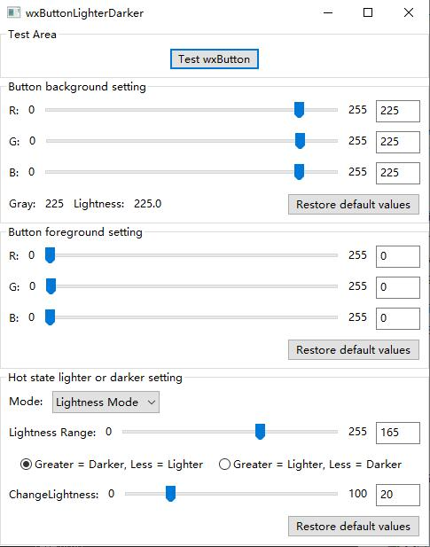
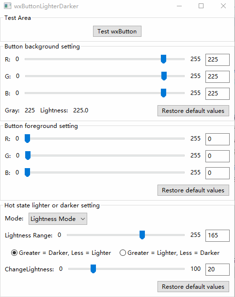

# wxButtonLighterDarker

[简体中文](README.zh-CN.md) | English

`wxButtonLighterDarker` is a Windows desktop demo built with `wxWidgets`. It demonstrates how a button can automatically switch between lighter and darker hover states based on the current background color. The project also allows you to adjust the button background, foreground, and threshold values in real time. It was created primarily to help verify `wxWidgets` issue [#26453](https://github.com/wxWidgets/wxWidgets/issues/26453).

## Features

- Real-time adjustment of button background and foreground colors using RGB controls
- Synchronized updates through sliders and text boxes
- Switch between grayscale-based and lightness-based decision modes
- Configure whether the hover state becomes lighter or darker
- Adjust the hover color change strength
- Restore default background, foreground, and threshold settings with one click

## Screenshots

### Main Window



### Demo Effect



## Overview

When the application starts, it shows a demo window with the following main areas:

- **Test Button**: used to observe the current button colors and hover effect
- **Background Color Settings**: controls the RGB values of the button background and displays the computed grayscale and lightness values
- **Foreground Color Settings**: controls the RGB values of the button text color
- **Mode Selection**: switches between grayscale-based and lightness-based decision logic
- **Threshold and Change Amount**: configures the threshold and hover color change amount

## How It Works

The project calculates two key values from the current background color:

- **Grayscale value**: used in grayscale mode to determine whether the background is considered light or dark
- **Lightness value**: used in lightness mode to determine whether the background is considered light or dark

Based on the selected rule and the current background, the button generates a corresponding hover background color when it enters the hot state.

## Project Structure

```text
wxButtonLighterDarker/
├─ wxButtonLighterDarker/        # Visual Studio project source directory
│  ├─ wxButtonLighterDarker.cpp  # Application entry point
│  ├─ wxButtonLighterDarker.h    # Application class declaration
│  ├─ Window_FrameDemo.cpp/.h    # Main window logic, event handling, and hot-state color logic
│  ├─ WxUIBase.cpp/.h            # wxFormBuilder-generated UI base class
│  ├─ wxTestButton.h             # Custom test button control, derived from wxButton
│  ├─ stdafx.cpp/.h              # Precompiled header files
│  ├─ targetver.h                # Windows SDK target version definition
│  └─ resource.h                 # Resource identifier definitions
├─ assets/                       # Screenshots and demo media
├─ include/                      # wxWidgets headers
├─ lib/                          # wxWidgets libraries
├─ wxButtonLighterDarker.sln     # Visual Studio solution
└─ README.md
```

## Build Environment

- **Operating system**: Windows 10
- **IDE**: Visual Studio 2022
- **GUI framework**: wxWidgets 3.3.3 (based on master commit `ddd2b3f`)
- **Library type**: static library
- **Runtime**: static runtime (`/MT`, `/MTd`)

### wxWidgets Build Notes

The wxWidgets build used by this project was configured with the following changes:

- Added `/MT` to `CMAKE_CXX_FLAGS_RELEASE`
- Added `/MTd` to `CMAKE_CXX_FLAGS_DEBUG`
- Disabled `wxBUILD_SHARED` to build static libraries instead of shared libraries
- Enabled `wxBUILD_USE_STATIC_RUNTIME` to use the static runtime

After building wxWidgets:

- Copy the generated `include` directory into the project root `include/` folder
- Copy the generated `lib` directory into the project root `lib/` folder (not included in the GitHub repository because of size)

## Build Instructions

1. Open `wxButtonLighterDarker.sln` in Visual Studio 2022
2. Select a configuration such as `Debug` or `Release`
3. Select a platform such as `Win32` or `x64`
4. Build and run the project

If you do not want to build it yourself, you can download the prebuilt release package for testing, available for the MSW platform only.

## How to Modify the Button Color Logic

The hover color logic is mainly implemented in `wxButtonLighterDarker/Window_FrameDemo.cpp`, inside `UpdateButtonUI()`. If you want to customize the behavior, the following parts are the most important.

### 1. Background and Foreground Input

The current implementation reads RGB values from the slider controls named `m_slider_background_*` and `m_slider_foreground_*`.
If you want to support other input sources, this is the place to extend.

### 2. Brightness Decision Rules

- Grayscale mode uses `RGB2GRAY(r, g, b)` to compute the grayscale value
- Lightness mode uses `GetLightness(r, g, b)` to compute the lightness value

If you need a more perceptually accurate approach, you can replace them with HSV, HSL, or a WCAG-based contrast calculation.

### 3. Threshold Logic

- `m_gray_range` and `m_lightness_range` are the threshold values for grayscale mode and lightness mode
- The current logic decides whether the hover state should be lighter or darker based on whether the background value crosses the threshold

### 4. Change Strength

- `m_change_val` controls how strongly the hover color changes
- The actual adjustment is done with `wxColour::ChangeLightness(100 ± m_change_val)`

If you want a softer effect, reduce this value or replace it with a custom interpolation algorithm.

### 5. Default Value Buttons

The default values are set in `EventButtonClickBackgroundDef()`, `EventButtonClickForegroundDef()`, and `EventButtonClickLdDef()`.
If you change the allowed ranges or the UI flow, remember to update those defaults as well.

If you want to extend the demo further, you can also add animation, separate pressed-state colors, or automatic theme adaptation based on the system theme.
